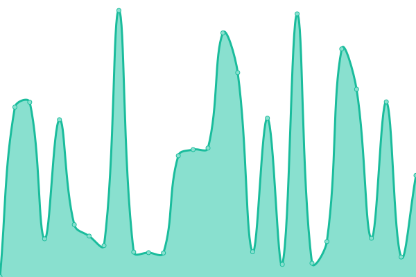

#  Status Page: <!--live status--> **🟥 Complete outage**

This repository contains the uptime monitor and status page of our managed websites, powered by [Upptime](https://github.com/upptime/upptime).

We use [Issues](https://github.com/alexchapar/status-page/issues) as incident reports, [Actions](https://github.com/alexchapar/status-page/actions) as uptime monitors, and [Pages](https://alexchapar.github.io/status-page) for the status page.

> With [Upptime](https://upptime.js.org), you can get your own unlimited and free uptime monitor and status page, powered entirely by a GitHub repository.

<!--start: status pages-->
<!-- This summary is generated by Upptime (https://github.com/upptime/upptime) -->
<!-- Do not edit this manually, your changes will be overwritten -->
<!-- prettier-ignore -->
| URL | Status | History | Response Time | Uptime |
| --- | ------ | ------- | ------------- | ------ |
|  [Web Busy Light Demo](https://workfromhome.capricehosting.com/) | 🟥 Down | [web-busy-light-demo.yml](https://github.com/alexchapar/status-page/commits/HEAD/history/web-busy-light-demo.yml) | 

 240ms
     
 | 

<a href="https://alexchapar.github.io/status-page/history/web-busy-light-demo">91.45%</a>
    

|  Secret Website 1 | 🟥 Down | [secret-website-1.yml](https://github.com/alexchapar/status-page/commits/HEAD/history/secret-website-1.yml) | 

 698ms
     
 | 

<a href="https://alexchapar.github.io/status-page/history/secret-website-1">97.59%</a>
    

|  Secret Website 3 | 🟥 Down | [secret-website-3.yml](https://github.com/alexchapar/status-page/commits/HEAD/history/secret-website-3.yml) | 

 1809ms
     
 | 

<a href="https://alexchapar.github.io/status-page/history/secret-website-3">91.68%</a>
    

|  Secret Website 4 | 🟥 Down | [secret-website-4.yml](https://github.com/alexchapar/status-page/commits/HEAD/history/secret-website-4.yml) | 

 1422ms
     
 | 

<a href="https://alexchapar.github.io/status-page/history/secret-website-4">91.71%</a>
    

<!--end: status pages-->

[**Visit our status website →**](https://alexchapar.github.io/status-page)

## 📄 License

- Powered by: [Upptime](https://github.com/upptime/upptime)
- Data in the `./history` directory: [Open Database License](https://opendatacommons.org/licenses/odbl/1-0/)
